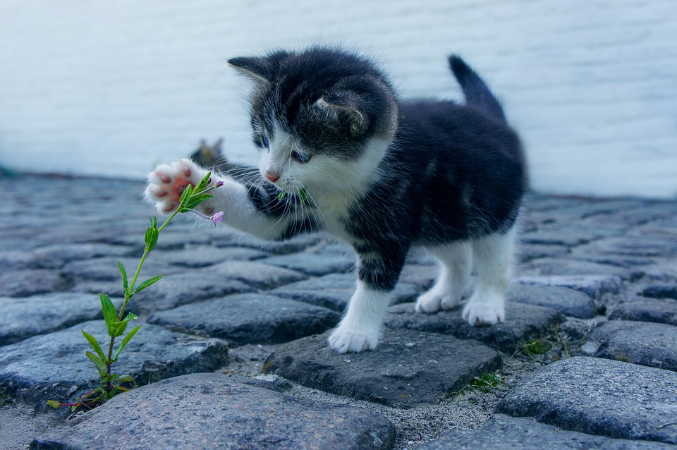

- Isabell V. S. Ernst
- University of Southern Denmark
- BMB

# Intro

**This** is the *intro*

# Methods and Results

**This** is the *methods and results*
## Analysis

# Discussion

**This** is the *Discussion* 


```{r}
2+2
```

```{r setup, include=FALSE}
source(here::here("R/package_loading.R"))
load(here::here("data/nhanes_small.rda"))
```

```{r mean-age-bmi-table}
nhanes_small %>%
    filter(!is.na(diabetes), !is.na(education)) %>% 
    group_by(diabetes, education) %>% 
    summarise(mean_age = mean(age, na.rm = TRUE),
              mean_bmi = mean(bmi, na.rm = TRUE)) %>% 
    ungroup() %>% 
    knitr::kable(caption = "Table caption. Mean values of Age and BMI for each education and diabetes status.")
```

```{r prettier-table, echo=FALSE}
nhanes_small %>%
    filter(!is.na(diabetes), !is.na(education)) %>% 
    group_by(diabetes, education) %>% 
    summarise(mean_age = mean(age, na.rm = TRUE),
              mean_bmi = mean(bmi, na.rm = TRUE)) %>% 
    ungroup() %>% 
    mutate(mean_age = round(mean_age, 1),
           mean_bmi = round(mean_bmi, 1),
           education = str_to_sentence(education)) %>% 
    rename("Diabetes Status" = diabetes, Education = education,
           "Mean Age" = mean_age, "Mean BMI" = mean_bmi) %>% 
    knitr::kable(caption = "Table caption. Mean values of Age and BMI for each education and diabetes status.")
```



```{r kitten-image, fig.cap="Image by Dimitri Houtteman From Pixabay.", fig.align='center', out.height="50%", out.width="50%"}
knitr::include_graphics(here::here("doc/images/kitten.jpg"))
```


